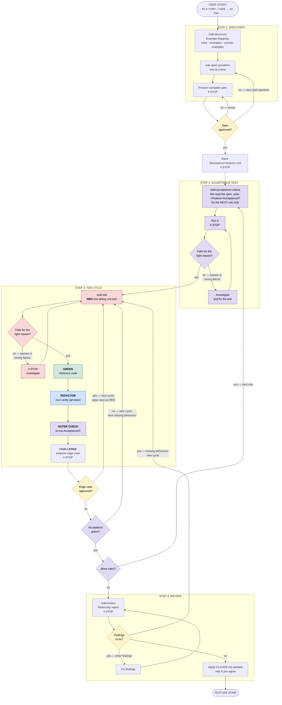

# order-fulfillment

## User Story: Order Fulfillment server

### Story Description
As a registered customer,
I want to place an order for multiple products in my cart,
so that the items are successfully reserved and prepared for shipping

## Development Process

Every user story follows the spec-driven development flow. The rules and conventions behind each
step live in [`CLAUDE.md`](CLAUDE.md) (Development Process, Testing, Architecture), in the step
commands under [`.claude/commands/`](.claude/commands/), and in the per-layer rules under
[`.claude/rules/`](.claude/rules/) (loaded automatically when editing files in that layer).

**Reading the diagram**

| Colour | Meaning |
|---|---|
| 🟪 Purple | **Outer loop** (acceptance level): write a rule's acceptance test, re-run it after every cycle, and move to the next rule once it is green. |
| 🟥 Red / 🟩 Green / 🟦 Blue | **Inner loop** (unit level): RED → GREEN → REFACTOR, one unit test per cycle. |
| 🟨 Yellow | **Your decision**: approving the spec, an edge case, or what to do with review findings. |
| ⬜ Plain | Supporting steps: discovery, CHALLENGE, review. |

- **OUTER CHECK drives the outer loop.** Its result (*Acceptance green?*) decides whether the
  rule needs another inner cycle or is done.
- **⏸ STOP** hands control back to you. Every `/sdd-*` step ends with one, and a test that passes
  when it should fail is always a STOP to investigate.
- **An approved edge case goes first.** It becomes the next RED even when the acceptance test is
  still red; the following OUTER CHECK picks up the remaining missing behaviour. Edge cases can
  also add cycles after the rule's acceptance test is green.
- **Review can send you back.** A missing behaviour becomes a new TDD cycle; other findings are
  fixed and re-reviewed before the feature is done.
